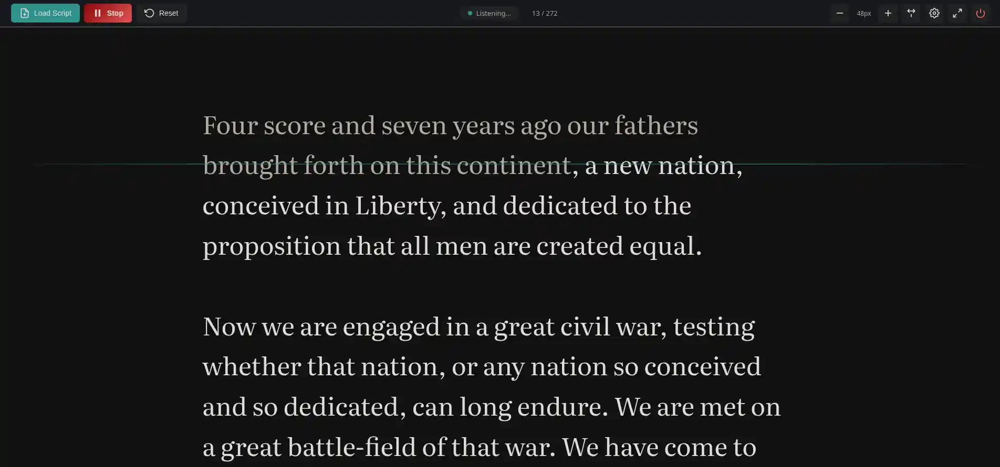

# Dave's Prompter

> **Maintenance Status:** 🛑 **As-Is / Passive** - This is a personal weekend project released for the community. I do not plan to provide active support or updates. Pull requests are welcome but may not be reviewed.

A teleprompter application that uses Vosk speech recognition to automatically scroll and highlight your script in sync with your spoken words. Designed for use with the **Elgato Prompter** on Linux (where official software is unavailable), but works with any screen.



## Features

- **Real-time speech recognition** - Uses Vosk for offline, low-latency speech-to-text
- **Auto-scroll sync** - Script scrolls automatically to match what you're saying
- **Spoken text dimming** - Words turn grey as you speak them, so you always know your place
- **Mirror mode** - Flip display horizontally for beam-splitter prompters
- **Universal Compatibility** - Runs in any web browser, making it compatible with tablets, phones, and any teleprompter screen

## Requirements

- Python 3.8+
- PortAudio (Required for microphone access via PyAudio)
- Vosk speech recognition model

## Installation

### 1. Install system dependencies

You need PortAudio for the microphone to work.

```bash
# Arch Linux
sudo pacman -S portaudio python-pyaudio

# Ubuntu/Debian
sudo apt install portaudio19-dev python3-pyaudio
```

### 2. Install Python dependencies

```bash
pip install -r requirements.txt
```

### 3. Download Vosk model

Download a Vosk model and extract it to the `models/` directory:

```bash
# Small English model (~50MB) - good balance of speed and accuracy
cd models
wget https://alphacephei.com/vosk/models/vosk-model-small-en-us-0.15.zip
unzip vosk-model-small-en-us-0.15.zip
cd ..
```

For better accuracy, you can use a larger model:
- `vosk-model-en-us-0.22` (~1.8GB) - Most accurate

## Usage

### 1. Start the server

```bash
python server.py
```

The server will start on `http://localhost:8765`

### 2. Open the prompter display

Open a browser on your Elgato Prompter screen and navigate to:
```
http://localhost:8765
```

### 3. Load your script

- Click "Load Script" and paste your script text
- Or drag and drop a text file onto the page

### 4. Start speaking

Click "Start" to begin speech recognition. The display will automatically scroll and highlight words as you speak.

## Configuration

Access settings via the gear icon:

- **Font Size** - Adjust text size for readability
- **Mirror Mode** - Flip display horizontally
- **Audio Device** - Select microphone input
- **Scroll Margin** - How far from the top the current line should be

## Keyboard Shortcuts

- `Space` - Start/Stop speech recognition
- `R` - Reset to beginning
- `+/-` - Increase/Decrease font size
- `M` - Toggle mirror mode

## Architecture

```
┌─────────────────┐     WebSocket      ┌──────────────────────┐
│  Python Backend │ ←───────────────→  │   Web Frontend       │
│  - Vosk ASR     │                    │   (Prompter Display) │
│  - Audio Input  │                    │   - Script Display   │
│  - Word Matching│                    │   - Auto-scroll      │
└─────────────────┘                    └──────────────────────┘
```

## Troubleshooting

### No audio input detected
- Check that your microphone is connected and selected
- Ensure PortAudio is installed: `pacman -S portaudio`
- List audio devices: `python -c "import pyaudio; p = pyaudio.PyAudio(); [print(i, p.get_device_info_by_index(i)['name']) for i in range(p.get_device_count())]"`

### Speech recognition is slow/inaccurate
- Try a larger Vosk model for better accuracy
- Ensure good microphone placement and minimal background noise
- Check CPU usage - speech recognition is CPU-intensive

## License

MIT License


