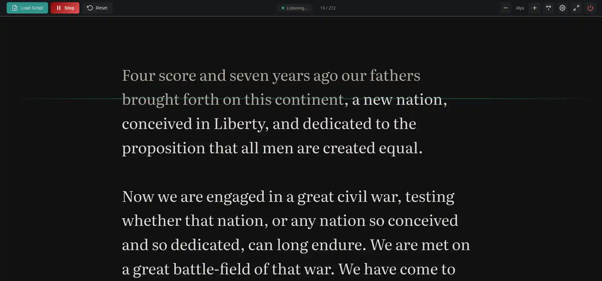

# Dave's Prompter


A teleprompter application that uses Vosk speech recognition to automatically scroll and highlight your script in sync with your spoken words. Designed for use with the **Elgato Prompter** but works with any screen on Linux, Windows, or Mac.



## Features

- **Real-time speech recognition** - Uses Vosk for offline, low-latency speech-to-text
- **Auto-scroll sync** - Script scrolls automatically to match what you're saying
- **HTTP Mirroring / Sync** - Open the app on your main computer, then open it on any other device (tablet, phone, second screen) on the same network. All instances stay perfectly in sync.
- **Spoken text dimming** - Words turn grey as you speak them, so you always know your place
- **Mirror mode** - Flip display horizontally for beam-splitter prompters
- **Universal Compatibility** - Runs in any web browser

## Requirements

- Python 3.8+
- PortAudio (Required for microphone access via PyAudio)
- Vosk speech recognition model

## Installation

### 1. Install system dependencies

You need PortAudio for the microphone to work.

**Windows/Mac:**
Usually, nothing special is needed as `pip install pyaudio` includes binaries. 
If it fails on Windows, install [Visual C++ Build Tools](https://visualstudio.microsoft.com/visual-cpp-build-tools/).
If it fails on Mac, use Homebrew: `brew install portaudio`

**Linux:**
You need to install the development headers:

```bash
# Arch Linux
sudo pacman -S portaudio python-pyaudio

# Ubuntu/Debian
sudo apt install portaudio19-dev python3-pyaudio
```

### 2. Install Python dependencies

```bash
pip install -r requirements.txt
```

### 3. Download Vosk model

Download a Vosk model and extract it to the `models/` directory:

1. Go to [https://alphacephei.com/vosk/models](https://alphacephei.com/vosk/models)
2. Download a model (e.g., `vosk-model-small-en-us-0.15` for speed or `vosk-model-en-us-0.22` for accuracy)
3. Unzip it into the `models` folder so you have `models/vosk-model-small-en-us-0.15/`

## Usage

### 1. Start the server

**Windows:**
Double-click `start.bat`.

**Linux/Mac:**
Run the startup script:
```bash
./start.sh
```

Or run directly with Python on any OS:
```bash
python server.py
```

The server will start on `http://localhost:8765`

### 2. Open the prompter display

Open a browser on your Elgato Prompter screen (or any other screen) and navigate to:
```
http://localhost:8765
```

**Remote Control / Mirroring:**
To control the prompter from a different device (e.g., using your laptop to control a tablet prompter), connect the second device to the same Wi-Fi network and navigate to:
```
http://<YOUR_COMPUTER_IP>:8765
```
Both screens will stay in sync.

### 3. Load your script

- Click "Load Script" and paste your script text
- Or drag and drop a text file onto the page

### 4. Start speaking

Click "Start" to begin speech recognition. The display will automatically scroll and highlight words as you speak.

## Controls & Settings

### Top Control Bar
- **Font Size** (`+/-`) - Adjust text size
- **Text Width** (`[`/`]`) - Adjust how wide the text block is on screen
- **Mirror Mode** (`M`) - Flip display horizontally for teleprompter glass
- **Fullscreen** (`F`) - Toggle fullscreen mode

### Settings Menu (Gear Icon)
- **Audio Device** - Select microphone input
- **Speech Model** - Choose which Vosk model to use
- **Reading Line Position** - Adjust where the active line sits vertically
- **Scroll Smoothness** - Tweak how quickly/smoothly the text reacts
- **Auto-hide controls** - Hide the top bar when the prompter is active

## Keyboard Shortcuts

- `Space` - Start/Stop speech recognition
- `R` - Reset to beginning
- `+/-` - Increase/Decrease font size
- `M` - Toggle mirror mode

## Architecture

```
┌─────────────────┐     WebSocket      ┌──────────────────────┐
│  Python Backend │ ←───────────────→  │   Web Frontend       │
│  - Vosk ASR     │    (Broadcasts)    │   (Prompter Display) │
│  - Audio Input  │                    │   - Script Display   │
│  - Word Matching│                    │   - Auto-scroll      │
└─────────────────┘                    └──────────────────────┘
```

## Troubleshooting

### No audio input detected
- Check that your microphone is connected and selected
- Ensure PortAudio is installed
- List audio devices: `python -c "import pyaudio; p = pyaudio.PyAudio(); [print(i, p.get_device_info_by_index(i)['name']) for i in range(p.get_device_count())]"`

### Speech recognition is slow/inaccurate
- Try a larger Vosk model for better accuracy
- Ensure good microphone placement and minimal background noise
- Check CPU usage - speech recognition is CPU-intensive

## License

MIT License


